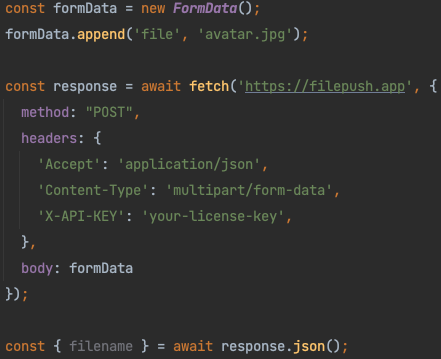

# Easy to use API endpoint for your app uploads.

Receive files without writing a single line of backend code. Perfect for your mobile app.

### Uploading files made easy.
Simply send us the file, we ensure it lands safely in AWS S3.

### Resizing options for images.
Want to save space? We can resize images before they are saved. 

### Roadmap
Filepush is still in development. The following features are ahead.
- Configurable caching for the download endpoint.
- Configurable rate-limiting for uploads and downloads.
- Resizing support for downloading images.

### Contact us
Are you interested in using Filepush, but are you still missing some features or need help?
Drop me a line at [mailto](mailto:joost@petsy.app).
